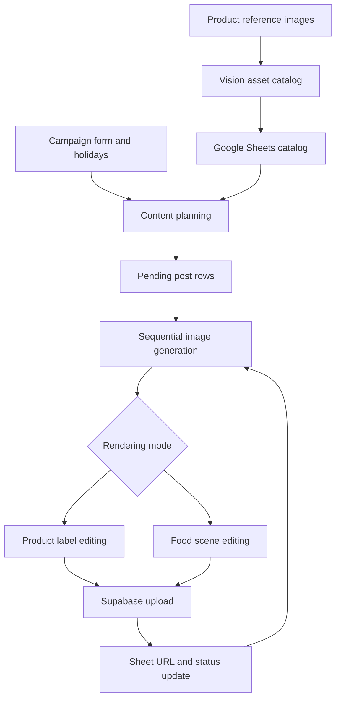

# N8N AI Content Engine

A 39-node n8n workflow that turns campaign dates and a product asset catalog into a structured content plan and branded image creatives. Built by Saurav Samal as a portfolio project for backend integration and workflow automation.

**Stack:** n8n · JavaScript · Gemini text/vision/image APIs · Google Sheets · Google Calendar · Supabase Storage

## What it does

- Indexes product reference images with Gemini vision into an asset catalog.
- Uses campaign dates, Indian holiday context and brand/product descriptions to plan captions, headlines, CTAs and image prompts.
- Processes pending `Post` rows sequentially, generates a raw image, selects logo/mascot assets and branches into packaging-label or food-scene editing.
- Preserves image binaries across intermediate nodes, normalizes the output, uploads it to Supabase and updates the matching Sheets row with its URL and completion status.

Reel script planning is present; video generation and automatic Instagram publishing are not included. Brand fidelity is prompt-guided and requires human review.

## Architecture

The catalog, planning and rendering pipelines have separate entry points. Initialize the catalog before planning a campaign, then manually start rendering.

## Explore

| File | Purpose |
| --- | --- |
| [Workflow export](workflows/social-media-gen-v8.sanitized.json) | Importable configuration with deployment values removed |
| [Setup guide](docs/setup.md) | Credentials, Sheets, assets and execution order |
| [Generated gallery](docs/gallery.md) | 17 supplied generated examples and 5 separately grouped reference images |
| [Technical documentation](docs/workflow-documentation.pdf) | Source project documentation; workbook ID redacted |
| [Limitations and validation](docs/validation.md) | Known integration issues and what was checked |
| [Demo walkthrough](docs/demo.md) | A short recording outline; no recording was supplied |
| [Sheet headers](schemas/) | Starter CSV headers for both tabs |

## Quick start

1. Import the sanitized JSON into n8n and keep it inactive while configuring it.
2. Create the `Sheet1` and `Asset_Catalog` tabs using the CSV headers.
3. Attach your Google Sheets, Calendar and Gemini credentials. Configure Supabase Custom Auth in n8n.
4. Replace `YOUR_GOOGLE_SHEET_ID` and every `https://YOUR_PROJECT.supabase.co` placeholder; upload your own product, logo, mascot, label and design assets.
5. Follow the setup guide and reconcile the noted field-mapping gaps before a one-post smoke test.

This is a configurable portfolio export, not a zero-configuration deployment. The packaged workflow has not been run against live services in this review.

## Implementation details worth inspecting

The JavaScript Code nodes demonstrate JSON extraction/parsing, content-row enrichment, input normalization, asset selection checks and binary preservation. Storage and Sheets updates connect the generation chain to persistent outputs rather than ending at a model response.

The package removes embedded authorization values, credential references, pinned execution data, deployment metadata and the original storage hostname. Supabase authentication is routed to n8n Custom Auth; batch size is explicitly set to one. Node names and graph connections are preserved.

## Attribution

Aquafoundry names, logos, product labels and supplied creative examples are included as project context. No open-source license or third-party asset redistribution rights are asserted by this package. Marketing statements in sample images are creative content, not independently verified product claims.
